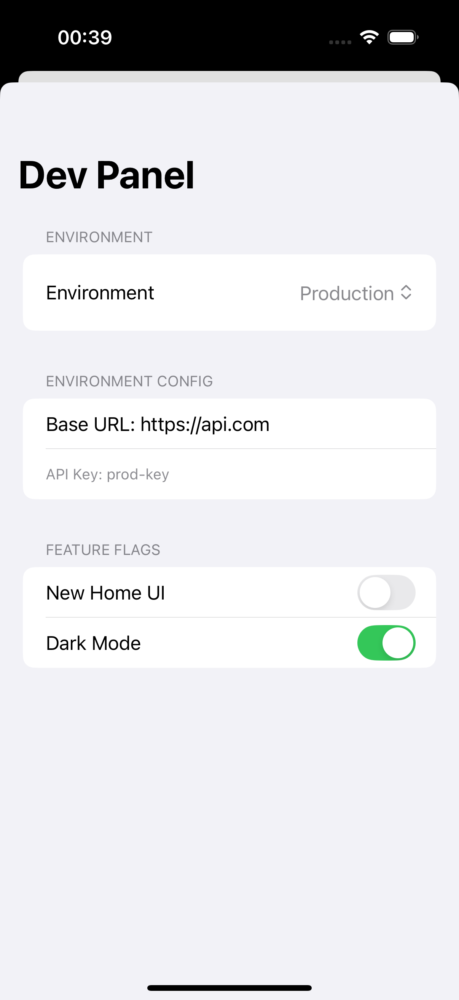

# 🛠️ DevPanel

A lightweight, developer-friendly **in-app dev panel** for SwiftUI apps.  
Easily switch environments, toggle feature flags, and inspect configuration values without rebuilding or hardcoding anything.

---

## ✨ Features

- ✅ Switch between Dev, Staging, and Production environments
- ✅ Toggle feature flags with default ON/OFF values
- ✅ Define environments and flags **in your app**, not the SDK
- ✅ SwiftUI-powered UI
- ✅ Persistent via `UserDefaults`
- ✅ Designed for real-world teams and modular apps

---

## 📸 UI Preview



---

## 📦 Installation

### Swift Package Manager (SPM)

1. Open your project in Xcode.
2. Go to **File > Add Packages…**
3. Paste the Git URL:

```bash
https://github.com/hkothari90/DevPanel.git
```

---

## ⚙️ Getting Started

### 1. Define Your App Environments

```swift
import DevPanel

let environments: [AppEnvironment] = [
    .init(name: "Production", baseURL: "https://api.example.com", apiKey: "prod-key"),
    .init(name: "Staging", baseURL: "https://staging.example.com", apiKey: "staging-key"),
    .init(name: "Development", baseURL: "http://localhost:3000", apiKey: "dev-key")
]
```

---

### 2. Define Your Feature Flags

```swift
let featureFlags: [FeatureFlag] = [
    .init(key: "featureFlag_darkMode", label: "Dark Mode"),
    .init(key: "featureFlag_newUI", label: "New UI")
]
```

---

### 3. Create & Inject the Debug Config

```swift
@main
struct MyApp: App {
    @StateObject var debugConfig = DebugConfig(
        environments: environments,
        defaultEnvironment: environments.first!,
        featureFlags: featureFlags
    )

    var body: some Scene {
        WindowGroup {
            ContentView()
                .environmentObject(debugConfig) // 🔁 App-wide injection
        }
    }
}
```

---

### 4. Present the Dev Panel UI

```swift
.sheet(isPresented: $showDevPanel) {
    DebugMenu(config: debugConfig)
}
```

---

## 🧪 Usage in Code

### Access selected environment:
```swift
let env = debugConfig.selectedEnvironment
print(env.baseURL)
```

---

## 🧩 Extension Ideas

- 🔌 Add remote feature flag support (Firebase Remote Config, LaunchDarkly)

---

## 🛡 License

MIT © 2025 Hardik Kothari

---

## 🙌 Contributing

Pull requests welcome!  
Please open an issue to discuss any bugs, ideas, or enhancements.
